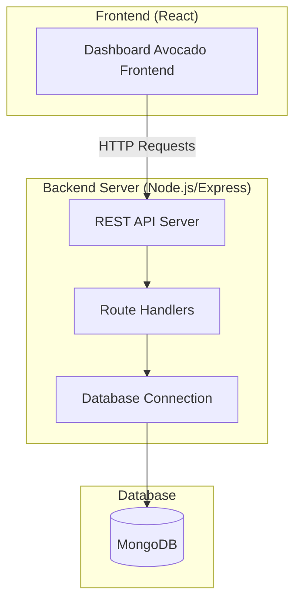
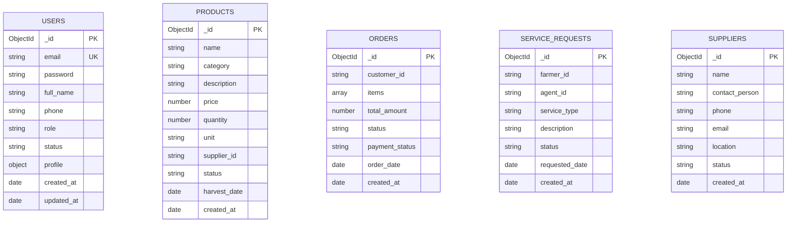

# Backend REST API Design for Dashboard Avocado System

## Overview

This document outlines a simple RESTful backend API design using Node.js and Express.js for the Dashboard Avocado agricultural management system. The backend will be an independent application from the existing frontend, using MongoDB as the primary database. The system supports multiple user roles (Admin, Agent, Farmer, Shop Manager) with basic CRUD operations and straightforward functionality.

## Simple Node.js/Express Architecture

The backend is a simple Express.js REST API server that handles HTTP requests and connects to MongoDB:



### Basic Setup Files

#### package.json
```json
{
  "name": "dashboard-avocado-backend",
  "version": "1.0.0",
  "description": "Backend API for Dashboard Avocado System",
  "main": "server.js",
  "scripts": {
    "start": "node server.js",
    "dev": "nodemon server.js",
    "test": "echo \"Error: no test specified\" && exit 1"
  },
  "dependencies": {
    "express": "^4.18.2",
    "mongoose": "^7.5.0",
    "bcryptjs": "^2.4.3",
    "jsonwebtoken": "^9.0.2",
    "cors": "^2.8.5",
    "dotenv": "^16.3.1",
    "express-validator": "^7.0.1"
  },
  "devDependencies": {
    "nodemon": "^3.0.1"
  }
}
```

#### .env
```
PORT=5000
MONGODB_URI=mongodb://localhost:27017/dashboard-avocado
JWT_SECRET=your-secret-key-here
JWT_EXPIRE=7d
NODE_ENV=development
```

#### server.js (Main Entry Point)
```javascript
const express = require('express');
const cors = require('cors');
const dotenv = require('dotenv');
const connectDB = require('./config/database');

// Load environment variables
dotenv.config();

// Connect to database
connectDB();

const app = express();

// Middleware
app.use(cors());
app.use(express.json());

// Routes
app.use('/api/auth', require('./routes/auth'));
app.use('/api/users', require('./routes/users'));
app.use('/api/products', require('./routes/products'));
app.use('/api/orders', require('./routes/orders'));
app.use('/api/service-requests', require('./routes/serviceRequests'));
app.use('/api/analytics', require('./routes/analytics'));

// Basic error handling
app.use((err, req, res, next) => {
  console.error(err.stack);
  res.status(500).json({ success: false, message: 'Server Error' });
});

// 404 handler
app.use('*', (req, res) => {
  res.status(404).json({ success: false, message: 'Route not found' });
});

const PORT = process.env.PORT || 5000;

app.listen(PORT, () => {
  console.log(`Server running on port ${PORT}`);
});
```

#### config/database.js
```javascript
const mongoose = require('mongoose');

const connectDB = async () => {
  try {
    const conn = await mongoose.connect(process.env.MONGODB_URI);
    console.log(`MongoDB Connected: ${conn.connection.host}`);
  } catch (error) {
    console.error('Database connection error:', error);
    process.exit(1);
  }
};

module.exports = connectDB;
```

```
dashboard-avocado-backend/
├── server.js                 # Main server file
├── package.json             # Dependencies
├── .env                     # Environment variables
├── .gitignore              # Git ignore file
├── README.md               # Project documentation
│
├── config/                 # Configuration files
│   └── database.js         # MongoDB connection
│
├── models/                 # MongoDB schemas
│   ├── User.js
│   ├── Product.js
│   ├── Order.js
│   ├── ServiceRequest.js
│   ├── Supplier.js
│   └── Transaction.js
│
├── routes/                 # API routes
│   ├── auth.js            # Authentication routes
│   ├── users.js           # User management
│   ├── products.js        # Product management
│   ├── orders.js          # Order management
│   ├── serviceRequests.js # Service requests
│   └── analytics.js       # Reports & analytics
│
├── middleware/             # Custom middleware
│   ├── auth.js            # JWT authentication
│   └── validate.js        # Input validation
│
└── utils/                  # Helper functions
    ├── bcrypt.js          # Password hashing
    └── jwt.js             # JWT token functions
```

## Simple MongoDB Schema Design

### Basic Collections Structure

The MongoDB database will have the following collections with simple, straightforward schemas:



### Simple Mongoose Models

#### models/User.js
```javascript
const mongoose = require('mongoose');

const userSchema = new mongoose.Schema({
  email: {
    type: String,
    required: true,
    unique: true
  },
  password: {
    type: String,
    required: true
  },
  full_name: {
    type: String,
    required: true
  },
  phone: String,
  role: {
    type: String,
    enum: ['admin', 'agent', 'farmer', 'shop_manager'],
    default: 'farmer'
  },
  status: {
    type: String,
    enum: ['active', 'inactive'],
    default: 'active'
  },
  profile: {
    age: Number,
    gender: String,
    province: String,
    district: String,
    farm_size: Number,
    crops: [String]
  }
}, {
  timestamps: true
});

module.exports = mongoose.model('User', userSchema);
```

#### models/Product.js
```javascript
const mongoose = require('mongoose');

const productSchema = new mongoose.Schema({
  name: {
    type: String,
    required: true
  },
  category: {
    type: String,
    required: true
  },
  description: String,
  price: {
    type: Number,
    required: true
  },
  quantity: {
    type: Number,
    required: true,
    default: 0
  },
  unit: {
    type: String,
    required: true
  },
  supplier_id: {
    type: String,
    required: true
  },
  status: {
    type: String,
    enum: ['available', 'out_of_stock'],
    default: 'available'
  },
  harvest_date: Date
}, {
  timestamps: true
});

module.exports = mongoose.model('Product', productSchema);
```

#### models/Order.js
```javascript
const mongoose = require('mongoose');

const orderSchema = new mongoose.Schema({
  customer_id: {
    type: String,
    required: true
  },
  items: [{
    product_id: String,
    product_name: String,
    quantity: Number,
    price: Number,
    total: Number
  }],
  total_amount: {
    type: Number,
    required: true
  },
  status: {
    type: String,
    enum: ['pending', 'completed', 'cancelled'],
    default: 'pending'
  },
  payment_status: {
    type: String,
    enum: ['pending', 'paid'],
    default: 'pending'
  },
  order_date: {
    type: Date,
    default: Date.now
  }
}, {
  timestamps: true
});

module.exports = mongoose.model('Order', orderSchema);
```

### Simple Authentication & Middleware

#### middleware/auth.js
```javascript
const jwt = require('jsonwebtoken');
const User = require('../models/User');

// Verify JWT token
const auth = async (req, res, next) => {
  try {
    const token = req.header('Authorization')?.replace('Bearer ', '');
    
    if (!token) {
      return res.status(401).json({ success: false, message: 'No token provided' });
    }
    
    const decoded = jwt.verify(token, process.env.JWT_SECRET);
    const user = await User.findById(decoded.id);
    
    if (!user) {
      return res.status(401).json({ success: false, message: 'Invalid token' });
    }
    
    req.user = user;
    next();
  } catch (error) {
    res.status(401).json({ success: false, message: 'Invalid token' });
  }
};

// Check user role
const authorize = (roles) => {
  return (req, res, next) => {
    if (!roles.includes(req.user.role)) {
      return res.status(403).json({ success: false, message: 'Access denied' });
    }
    next();
  };
};

module.exports = { auth, authorize };
```

#### utils/jwt.js
```javascript
const jwt = require('jsonwebtoken');

// Generate JWT token
const generateToken = (userId) => {
  return jwt.sign({ id: userId }, process.env.JWT_SECRET, {
    expiresIn: process.env.JWT_EXPIRE || '7d'
  });
};

module.exports = { generateToken };
```

#### utils/bcrypt.js
```javascript
const bcrypt = require('bcryptjs');

// Hash password
const hashPassword = async (password) => {
  const salt = await bcrypt.genSalt(10);
  return bcrypt.hash(password, salt);
};

// Compare password
const comparePassword = async (password, hashedPassword) => {
  return bcrypt.compare(password, hashedPassword);
};

module.exports = { hashPassword, comparePassword };
```

## Simple REST API Endpoints

### Basic Response Format

#### Success Response
```json
{
  "success": true,
  "data": {},
  "message": "string"
}
```

#### Error Response
```json
{
  "success": false,
  "message": "string"
}
```

### Basic Route Examples

#### routes/auth.js
```javascript
const express = require('express');
const User = require('../models/User');
const { hashPassword, comparePassword } = require('../utils/bcrypt');
const { generateToken } = require('../utils/jwt');
const router = express.Router();

// Register
router.post('/register', async (req, res) => {
  try {
    const { email, password, full_name, role } = req.body;
    
    // Check if user exists
    const existingUser = await User.findOne({ email });
    if (existingUser) {
      return res.status(400).json({ success: false, message: 'User already exists' });
    }
    
    // Hash password and create user
    const hashedPassword = await hashPassword(password);
    const user = await User.create({
      email,
      password: hashedPassword,
      full_name,
      role: role || 'farmer'
    });
    
    const token = generateToken(user._id);
    res.status(201).json({
      success: true,
      data: { token, user: { id: user._id, email: user.email, role: user.role } },
      message: 'User registered successfully'
    });
  } catch (error) {
    res.status(500).json({ success: false, message: error.message });
  }
});

// Login
router.post('/login', async (req, res) => {
  try {
    const { email, password } = req.body;
    
    // Find user
    const user = await User.findOne({ email });
    if (!user) {
      return res.status(400).json({ success: false, message: 'Invalid credentials' });
    }
    
    // Check password
    const isMatch = await comparePassword(password, user.password);
    if (!isMatch) {
      return res.status(400).json({ success: false, message: 'Invalid credentials' });
    }
    
    const token = generateToken(user._id);
    res.json({
      success: true,
      data: { token, user: { id: user._id, email: user.email, role: user.role } },
      message: 'Login successful'
    });
  } catch (error) {
    res.status(500).json({ success: false, message: error.message });
  }
});

module.exports = router;
```

#### routes/users.js
```javascript
const express = require('express');
const User = require('../models/User');
const { auth, authorize } = require('../middleware/auth');
const router = express.Router();

// Get all users (Admin only)
router.get('/', auth, authorize(['admin']), async (req, res) => {
  try {
    const users = await User.find().select('-password');
    res.json({ success: true, data: users });
  } catch (error) {
    res.status(500).json({ success: false, message: error.message });
  }
});

// Get user by ID
router.get('/:id', auth, async (req, res) => {
  try {
    const user = await User.findById(req.params.id).select('-password');
    if (!user) {
      return res.status(404).json({ success: false, message: 'User not found' });
    }
    res.json({ success: true, data: user });
  } catch (error) {
    res.status(500).json({ success: false, message: error.message });
  }
});

// Update user
router.put('/:id', auth, async (req, res) => {
  try {
    const user = await User.findByIdAndUpdate(req.params.id, req.body, { new: true }).select('-password');
    res.json({ success: true, data: user, message: 'User updated successfully' });
  } catch (error) {
    res.status(500).json({ success: false, message: error.message });
  }
});

// Delete user (Admin only)
router.delete('/:id', auth, authorize(['admin']), async (req, res) => {
  try {
    await User.findByIdAndDelete(req.params.id);
    res.json({ success: true, message: 'User deleted successfully' });
  } catch (error) {
    res.status(500).json({ success: false, message: error.message });
  }
});

module.exports = router;
```

### Basic API Endpoints List

#### Authentication Routes (/api/auth)
- `POST /api/auth/register` - Register new user
- `POST /api/auth/login` - User login

#### User Management (/api/users)
- `GET /api/users` - Get all users (Admin only)
- `GET /api/users/:id` - Get user by ID
- `PUT /api/users/:id` - Update user
- `DELETE /api/users/:id` - Delete user (Admin only)

#### Product Management (/api/products)
- `GET /api/products` - Get all products
- `GET /api/products/:id` - Get product by ID
- `POST /api/products` - Create new product
- `PUT /api/products/:id` - Update product
- `DELETE /api/products/:id` - Delete product

#### Order Management (/api/orders)
- `GET /api/orders` - Get all orders
- `GET /api/orders/:id` - Get order by ID
- `POST /api/orders` - Create new order
- `PUT /api/orders/:id` - Update order
- `PUT /api/orders/:id/status` - Update order status

#### Service Requests (/api/service-requests)
- `GET /api/service-requests` - Get all service requests
- `GET /api/service-requests/:id` - Get service request by ID
- `POST /api/service-requests` - Create new service request
- `PUT /api/service-requests/:id` - Update service request
- `PUT /api/service-requests/:id/assign` - Assign agent to request

#### Analytics (/api/analytics)
- `GET /api/analytics/dashboard` - Get dashboard statistics
- `GET /api/analytics/sales` - Get sales data
- `GET /api/analytics/products` - Get product analytics

## Simple Development Setup

### Getting Started

1. **Create new project directory:**
```bash
mkdir dashboard-avocado-backend
cd dashboard-avocado-backend
```

2. **Initialize project:**
```bash
npm init -y
```

3. **Install dependencies:**
```bash
npm install express mongoose bcryptjs jsonwebtoken cors dotenv express-validator
npm install -D nodemon
```

4. **Create basic folder structure:**
```bash
mkdir config models routes middleware utils
```

5. **Setup environment variables (.env):**
```
PORT=5000
MONGODB_URI=mongodb://localhost:27017/dashboard-avocado
JWT_SECRET=your-secret-key-here
NODE_ENV=development
```

6. **Run the server:**
```bash
npm run dev
```

### Basic Testing with Postman

#### Test User Registration
```
POST http://localhost:5000/api/auth/register
Content-Type: application/json

{
  "email": "admin@example.com",
  "password": "password123",
  "full_name": "Admin User",
  "role": "admin"
}
```

#### Test User Login
```
POST http://localhost:5000/api/auth/login
Content-Type: application/json

{
  "email": "admin@example.com",
  "password": "password123"
}
```

## Basic Implementation Guidelines

### Keep It Simple
- Use basic CRUD operations for all entities
- Simple authentication with JWT tokens
- Basic role-based access (admin, agent, farmer, shop_manager)
- Standard HTTP status codes and JSON responses
- Basic error handling with try-catch blocks

### Database Operations
- Use Mongoose for MongoDB operations
- Keep schemas simple with basic validation
- Use async/await for database calls
- Basic indexes on frequently queried fields

### Security
- Hash passwords with bcryptjs
- Use JWT for authentication
- Basic role-based authorization
- CORS enabled for frontend communication

### Development Tips
- Use nodemon for auto-restart during development
- Test endpoints with Postman or similar tools
- Keep environment variables in .env file
- Use meaningful error messages
- Log important operations to console

This backend API design provides a solid foundation for the Dashboard Avocado system with basic CRUD operations, simple authentication, and straightforward data management using Node.js, Express, and MongoDB.